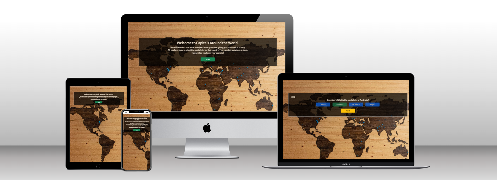

#Milestone Project 2: Capitals Around the World!

Welcome to my second milestone project with the Code Institute. The purpose of this project is to produce an interactive front end web application, built with HTML, CSS and JavaScript. Please find my deployed site [here](https://clawrence00.github.io/capitals_quiz/).

---

## Technologies used
- HTML5
- CSS3
- JavaScript
- Balsamiq
- Bootstrap 5.3.0
- jQuery
- Google Fonts
- GitHub
- codeanywhere

---

## UX & UI
### Project Goals

### Customer Goals

### Features

### User Stories

### Wireframes
Before any code was written wireframes were created using [Balsamiq](https://balsamiq.com/) for each page on three different screen sizes; mobile, tablet and desktop.

[See all wireframes here](#https://github.com/clawrence00/documentation/images/wireframes.png)

### Design Choices

#### Font

#### Colours

#### Styling

#### Images

---

## Credits
### Code

### Content

 ---
 
## Testing

### Bugs & Fixes

### Validation

---

### Deployment
The website was deployed using GitHub Pages. Here are the following steps required to **deploy the site**;

1) Select the repository.
2) In the repository navigation click 'Settings'.
3) In the list on the left, under 'Code and automation' select 'Pages'.
4) Under 'Build and deployment', 'Source' should be 'Deploy from branch'.
5) Under 'Build and deployment', 'Branch' select 'main'. The folder should be /(root). Click 'Save'.

Your site should now be live and hosted by GitHub Pages. It may take a minute or two for the site to become available.

To **clone this repository**;

1) On GitHub.com select the main page of the repository.
2) Click the green 'Code' button.
3) Select HTTPS. Click the clipboard icon to copy the repository URL.
4) Create a location on your machine where you want the repository to be cloned.
5) Using Git Bash change the working directory to the location where you want the repository to be cloned.
6) Type _git clone_ and paste the URL of the repository, copied in step 3.
7) Press enter. A local clone has now been created on your machine.  